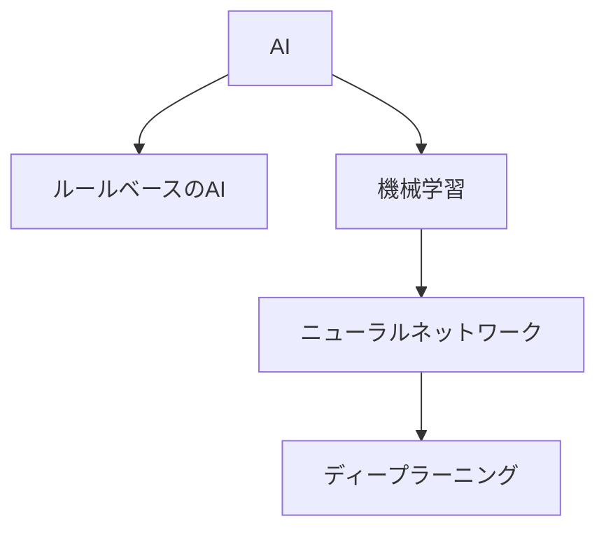

# php-ml-example

PHPで機械学習の基礎、勾配降下法を体験する為のサンプルコード集です。

題材はTensorFlowの[線形回帰のチュートリアル](https://www.tensorflow.org/tutorials/keras/regression?hl=ja)をPHPで進める形なっています。

# 使い方
- 起動
```
docker compose up
```
- アクセス
  - テストデータの表示
    - http://127.0.0.1:8080/step1.php 
  - 最小二乗法を用いた線形回帰
    - http://127.0.0.1:8080/step2.php
  - 勾配降下法を用いた線形回帰
    - http://127.0.0.1:8080/step3.php
  - ニューラルネットワークを用いた非線形回帰 
    - http://127.0.0.1:8080/step4.php
  - 上記に誤差情報を追加
    - http://127.0.0.1:8080/step5.php


# [1]　AI・機械学習とは

ChatGPTの登場以降、生成AIを始めとしたAIに注目が集まっています。一方でAI、人工知能は1956年にダートマス会議で定義された概念で長い歴史のある研究分野です。

AIの定義はさまざまですが、どのような作り方であっても十分に賢いふるまいを提供していればAIと呼ばれます。if文のような通常のプログラミングやデータベースで作られたAIはルールベースのAIと呼ばれます。

一方で近年は機械学習という手法に注目があつまっており、その中心になっているのがニューラルネットワークが複雑化したディープラーニングです。
生成AIなど最近注目が集まっているAIの多くがディープラーニングによって作られています。




機械学習の多くは大量のデータを準備し、データを学習した後に、推論を行うという流れで動作します。世の中の多くのAIが機械学習を利用しているという事はそのAIの開発には大量のデータが利用され。またその学習の処理にはかなりの時間が費やされていると言えます。

またデータの用意と学習は開発フェーズで開発者が行いますが、推論部分はプロダクション環境や利用者の端末などで高速に行うことができます。

# [2] 数値を予測するAI

数値を予測するAIは機械学習の中でも基本のタスクです。数値のデータから数値を予測するという処理は売上の予測やトレンドの分析などビジネスの中で活用されやすい処理です。

今回は線形回帰を取り扱います。
線形回帰は入力となるデータ（説明変数）が一つの単回帰分析、複数のデータが入力される重回帰分析があります。じつはExcelなどでも行える処理ですが、プログラミングを利用して実装する事でさらなる発展にも繋がります。

今回は馬力（horsepower)の数値を元に燃費(MPG)を予測するという例題です。

## [2-1] step1.php

学習に利用するデータをchart.jsを使ってプロットしています。
学習データが`$dataset`に格納されJavaScriptに渡される流れを把握できれば大丈夫です。

## [2-2] step2.php

最小二乗法を利用して数学的に回帰線をプロットしています。
今回は下記の部分が数学的な解放をコードに落としているという事だけ把握できれば大丈夫です。

```php
$m = ($n * $sum_xy - $sum_x * $sum_y) / ($n * $sum_x_squared - $sum_x * $sum_x);
$b = ($sum_y - $m * $sum_x) / $n;
```

`linear_regression`関数が`$slope`と`$intercept`を返し、その値がグラフの描画に利用されています。

# [3] 勾配降下法

勾配降下法はデータを順次処理しながら最適な重み（パラメータ）を探索していくアルゴリズムです。
重みは小数点付きの実数ですので、総当たりなどでは探索する事は現実的ではありません。勾配降下法ではその時点での重みで試算した予測値と実際のデータの誤差（エラー）を見ながら重みを調整していきます。

具体的には下記の部分のコードを追ってみてください。

1. 最初のforループは`$epoch`の分だけ繰り返される処理です
2. `$learning_rate`は重みの調整をどれくらい行うかの係数です。繰り返しが進むと小さくなるように制御しています
3. ２つ目のforループは`$horsepower`の件数分だけ繰り返されます。このループは１つ目のループの中にあるのでこの中の処理は`$epochs` * `count($horsepower)`の回数、つまりかなりの回数実行されます。
4. `$error`はその時点での重みで予測した予測値と実際のデータの誤差を示しています。完全に正確な予測ができれば0、予測が間違えば間違うほど大きな値になります。
5. `$weights`の更新は`$error`と`$learning_rate`の大きさに応じた値を減算、加算して行います。予測が大きく間違えば重みを大きく調整し、予測が答えに近ければ小さな調整を行います。
6. 上記のループを完走すると`$weights`の値はかなり正確な値に近づく事が期待されます。

```php
for ($epoch = 0; $epoch < $epochs; $epoch++) {
    // 線形に学習率を減少させる
    $learning_rate = $initial_learning_rate - ($initial_learning_rate - $final_learning_rate) * ($epoch / $epochs);

    $total_mse = 0; // MSE計算のための合計エラー
    $total_mae = 0;

    for ($i = 0; $i < count($horsepower); $i++) {
        $predicted = predict($weights, $horsepower[$i]); //推論
        $error = $mpg[$i] - $predicted;
        $total_mse += $error * $error; // 二乗誤差の合計を計算
        $total_mae += abs($error); // 絶対誤差の合計を計算

        // 重みを更新
        $weights[0] -= $learning_rate * (-2 * $horsepower[$i] * $error);
        $weights[1] -= $learning_rate * (-2 * $error);
    }
    $mse = $total_mse / count($horsepower); // 平均二乗誤差を計算
    $mae = $total_mae / count($horsepower); // 平均絶対誤差を計算

    // 必要に応じて各エポックのMSEと学習率を表示
    // echo "Epoch {$epoch}: MSE = {$mse}, Learning rate = {$learning_rate}\n";
}
```

## [3-1] ハイパーパラメータ
勾配降下法は繰り返し処理を通じて最適な重みを探索しますが、その探索を行う回数や学習率によって重みがたどり着く結果は変わってきます。これらの条件設定をハイパーパラメータと呼びます。

コード内では下記の部分がハイパーパラメータに当たります。

```php
// ハイパーパラメータ設定
$initial_learning_rate = 0.000045; // 初期の学習率を大きく設定
$final_learning_rate = 0.0000001; // 最終的な学習率
$epochs = 3000;
$weights = [0, 0];
```

# [4] ニューラルネットワーク

step3.phpの線形回帰では勾配降下法で調整するパラメーターは傾きと切片の２つでした。この予測をニューラルネットワークを使った形に発展させます。

Rubix/MLを利用する事で比較的シンプルな設定でニューラルネットワークを設定できます。

```php
$estimator = new MLPRegressor([
    new Dense(64),
    new Activation(new ReLU()),
    new Dense(64),
    new Activation(new ReLU()),
],
    64, // batch size
    new Adam(0.001), // optimizer
    1e-4, // Penalty
    100, // epochs    
);
```

step4.phpではニューラルネットワークを利用した事で曲がった予測値の線、非線形な予測が実現できます。


# [5] 理解を深める為の次の一歩

## ハイパーパラメーターを変更して性能を上げる

勾配降下法で重みがどこに収束するかは事前の条件によって変わります。設定を変更することで誤差が少なくなれば性能を向上させたという事ができます。今回のコードではMAE(平均絶対誤差)を算出しているので、設定を変えた結果、MAEがどのように変化するかを確認してみてください。

### step3.php
下記の設定でのMAEは4.1284024634384
- 学習率、エポック数、初期値などの変更で学習の進み方が変わる。
```php
// ハイパーパラメータ設定
$initial_learning_rate = 0.000045; // 初期の学習率を大きく設定
$final_learning_rate = 0.0000001; // 最終的な学習率
$epochs = 3000;
$weights = [0, 0];
```

### step5.php
下記の設定でのMAEは3.3915150225828
- Denseのノード数、optimizer (学習率) epoch(エポック)などの変更で挙動が変化する。
```php
$estimator = new MLPRegressor([
    new Dense(64),
    new Activation(new ReLU()),
    new Dense(64),
    new Activation(new ReLU()),
],
    64, // batch size
    new Adam(0.001), // optimizer
    1e-4, // Penalty
    100, // epochs    
);
```

# ローカルで実行できるように同梱したデータ

- auto-mpg.data by R. Quinlan [[original](https://archive.ics.uci.edu/dataset/9/auto+mpg)]
- [chart.js](https://www.chartjs.org/)
